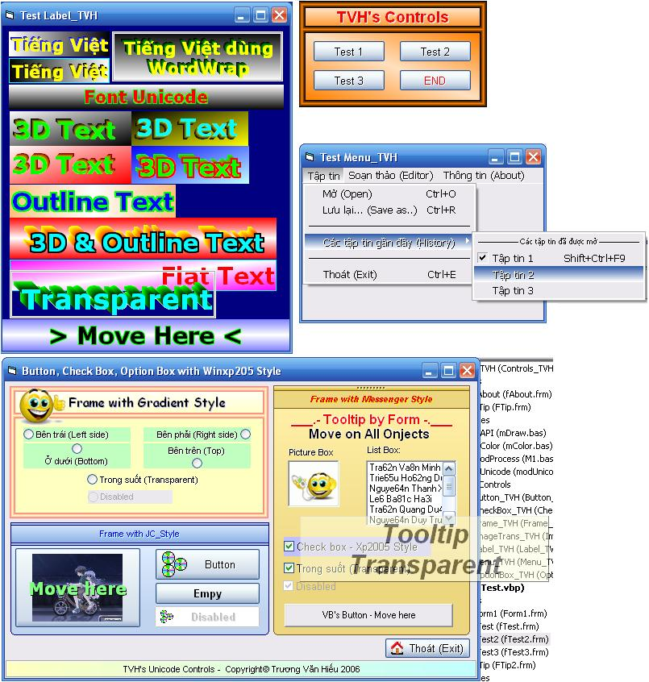



## TVH's Unicode Controls

### Description

Unicode Controls: CheckBox,OptionBox,Button Xp2005 Style, Menu Custom, Label3D...
 
### More Info
 

             |
---                |---
**Submitted On**   |2006-05-09 21:51:50
**By**             |[Van Hieu](https://github.com/Planet-Source-Code/PSCIndex/blob/master/ByAuthor/van-hieu.md)
**Level**          |Intermediate
**User Rating**    |4.4 (31 globes from 7 users)
**Compatibility**  |VB 6\.0
**Category**       |[OLE/ COM/ DCOM/ Active\-X](https://github.com/Planet-Source-Code/PSCIndex/blob/master/ByCategory/ole-com-dcom-active-x__1-29.md)
**World**          |[Visual Basic](https://github.com/Planet-Source-Code/PSCIndex/blob/master/ByWorld/visual-basic.md)
**Archive File**   |[TVH's\_Unic1993345112006\.zip](https://github.com/Planet-Source-Code/van-hieu-tvh-s-unicode-controls__1-65284/archive/master.zip)

